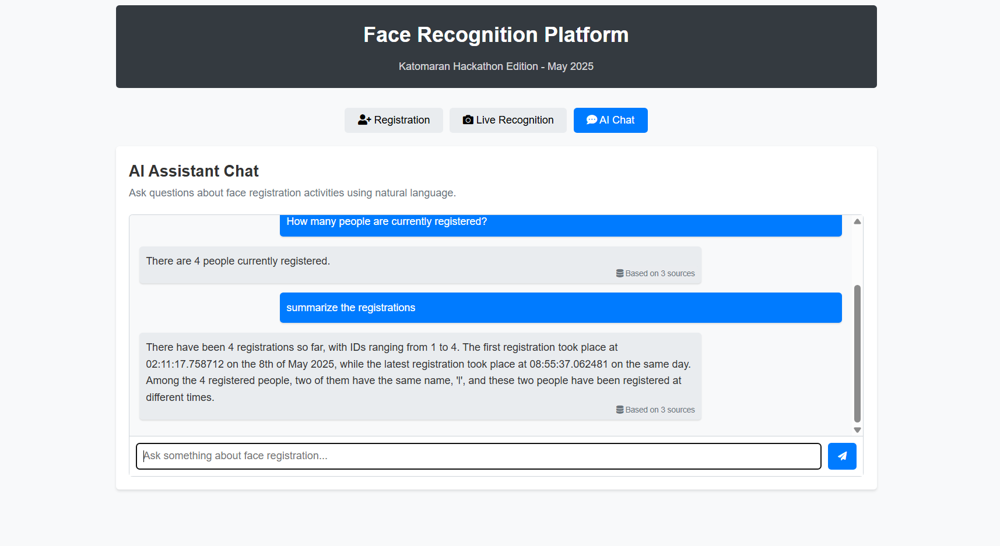

# FaceTrace

A sophisticated face recognition platform that enables local, privacy-focused multi-face detection, real-time identification, and AI-powered conversational interactions.

---

## 🌟 Key Features

- **Local Face Registration**: Register unique faces with names to the database. Similar faces are automatically rejected.
- **Real-time Multi-face Detection**: Detect and recognize multiple faces simultaneously with bounding boxes and confidence scores.
- **Confidence Scores**: Display recognition confidence percentages for each detected face.
- **AI-powered Chat Interface**: Ask questions about registered faces using natural language.
- **Enhanced RAG System**: Utilizes LangChain + FAISS + Cohere for intelligent responses.
- **Privacy-First Approach**: All processing happens locally, ensuring user data privacy.

---

## 🎥 Demo Video

Watch the demo video to see the platform in action:

[](attached_assets/demo_video.mp4)

---

## 📸 Screenshots

### Registration Tab


### Recognition Tab


### AI Chat Tab


---

## 📋 System Requirements

- **Node.js** (v14+)
- **Python** (3.8+)
- **PostgreSQL** database
- **Webcam Access**

---

## 🔧 Installation & Setup

### 1. Clone the Repository

```bash
git clone https://github.com/lakshmanpanda/FaceTrace.git
cd FaceTrace
```

### 2. Install Backend Dependencies

```bash
cd backend
npm install
```

### 3. Install Python Dependencies

```bash
pip install -r requirements.txt
```

Alternatively, you can install the required Python packages individually:

```bash
pip install opencv-python-headless numpy face-recognition dlib psycopg2-binary langchain langchain-community langchain-cohere faiss-cpu pillow cohere
```

### 4. Set Up PostgreSQL Database

Ensure PostgreSQL is installed and running. Then create a database for the application:

```bash
createdb db_name
```

### 5. Configure Environment Variables

Create a `.env` file in the backend directory with the following variables:

```properties
PGHOST=localhost
PGUSER=your_username
PGPASSWORD=your_password
PGDATABASE=db_name
PGPORT=5432
COHERE_API_KEY=your_cohere_api_key  # Required for enhanced RAG functionality
```

### 6. Install Frontend Dependencies

```bash
cd frontend
npm install
```

### 7. Start the Application

#### Start the Backend:
```bash
cd backend
npm start
```

#### Start the Frontend:
```bash
cd frontend
npm start
```

The frontend will be available at `http://localhost:3000`, and the backend will run on `http://localhost:5000`.

---

## 🔍 Application Usage

### Registration Tab
1. Enter a name for the person.
2. Click "Capture" to take a photo.
3. Click "Register" to save the face in the database.
4. If the face is too similar to an already registered face, the system will reject it.

### Recognition Tab
1. Click "Start Recognition" to begin real-time detection.
2. Recognized faces will be highlighted with bounding boxes and names.
3. Confidence scores show the accuracy of recognition.

### AI Chat Tab
1. Type questions about registered faces (e.g., "Who was the last person registered?").
2. The AI will respond with relevant information and source references.

---

## 🧩 System Architecture

The application follows a three-tier architecture:

1. **Frontend Layer**: A React-based web UI for user interactions.
2. **Backend Layer**: Node.js Express server providing API endpoints and WebSocket communication.
3. **AI Services Layer**: Python-based services for face recognition and RAG (Retrieval-Augmented Generation).

---

## 🛠️ Technologies Used

- **Frontend**: React, Bootstrap, Framer Motion
- **Backend**: Node.js, Express, WebSockets
- **Face Recognition**: OpenCV, face_recognition library
- **Database**: PostgreSQL
- **RAG System**: LangChain, FAISS, Cohere LLM

---

## 📱 Accessing Remotely

To access the application from other devices or over the internet, you can use localtunnel:

```bash
# Install localtunnel if not already installed
npm install -g localtunnel

# Start the tunnel (after starting the application)
lt --port 5000 --subdomain face-recognition-platform
```

Then access your application at the URL provided by localtunnel.

---

## 🤝 Contributing

Contributions, issues, and feature requests are welcome! Feel free to fork the repository and submit pull requests.

---
